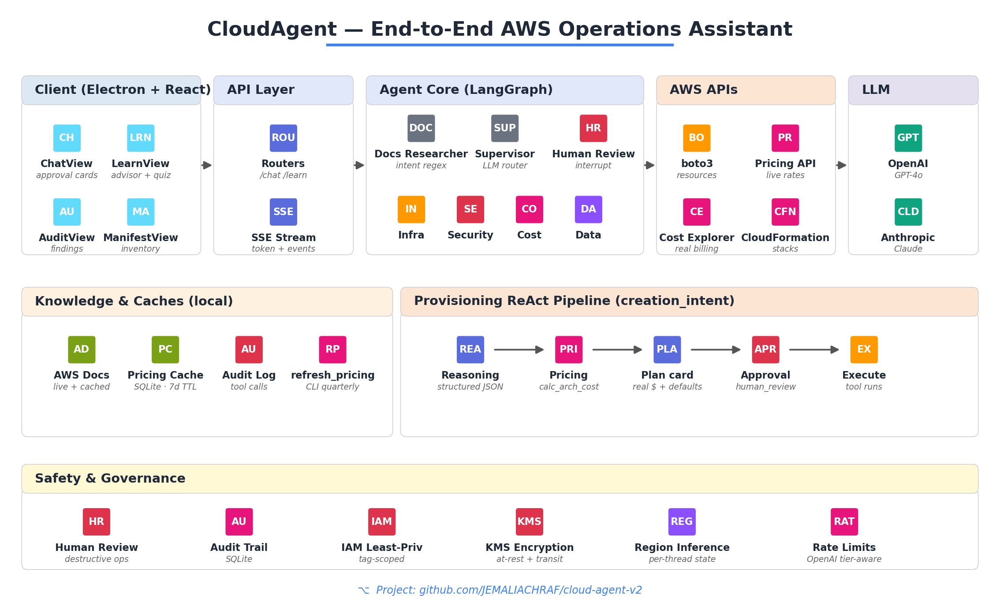
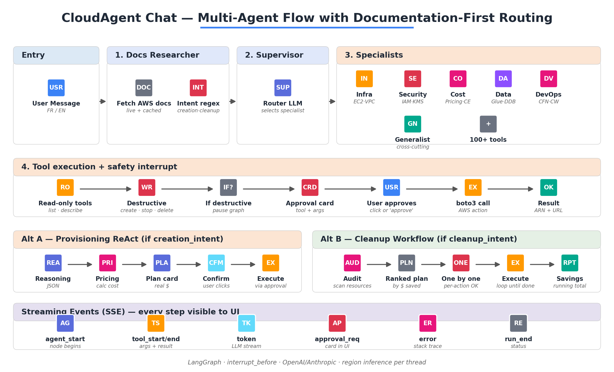
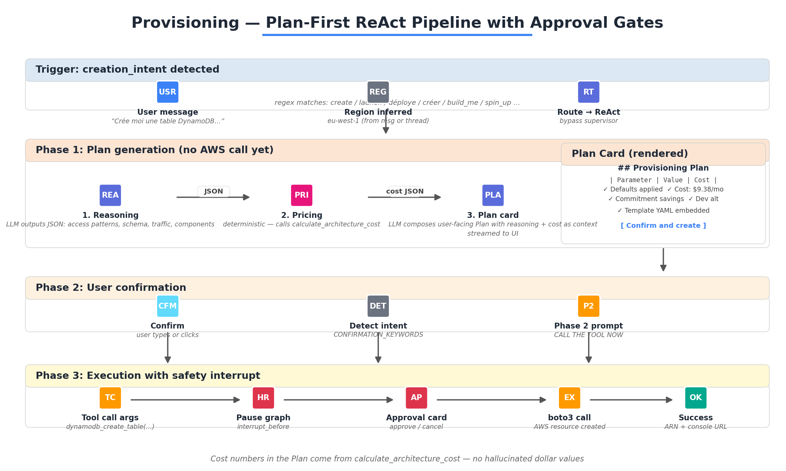
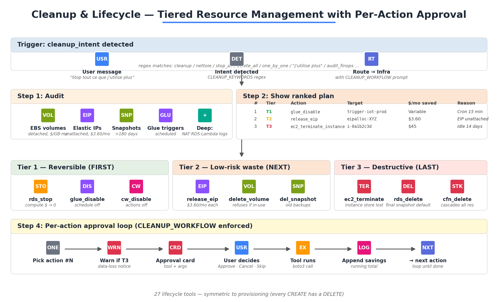
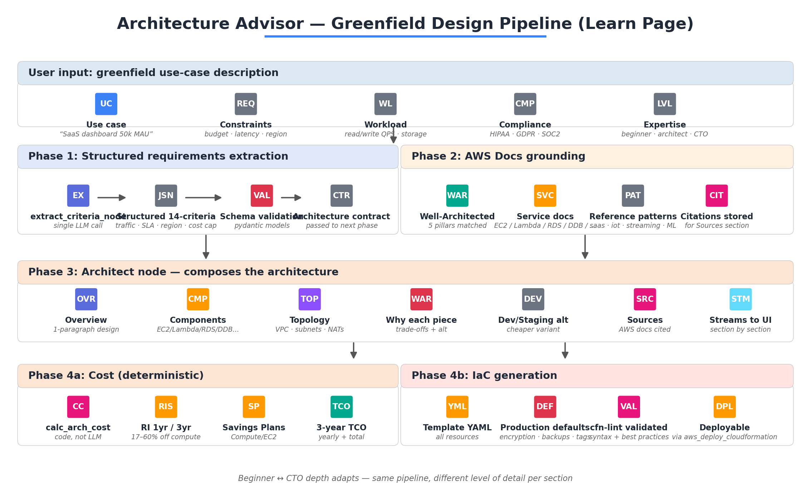
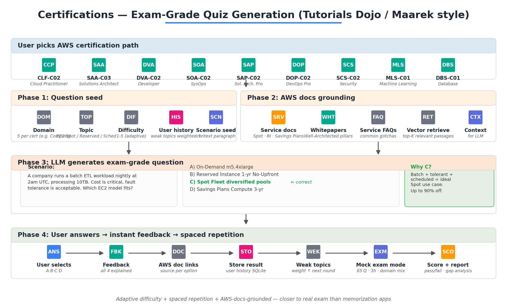
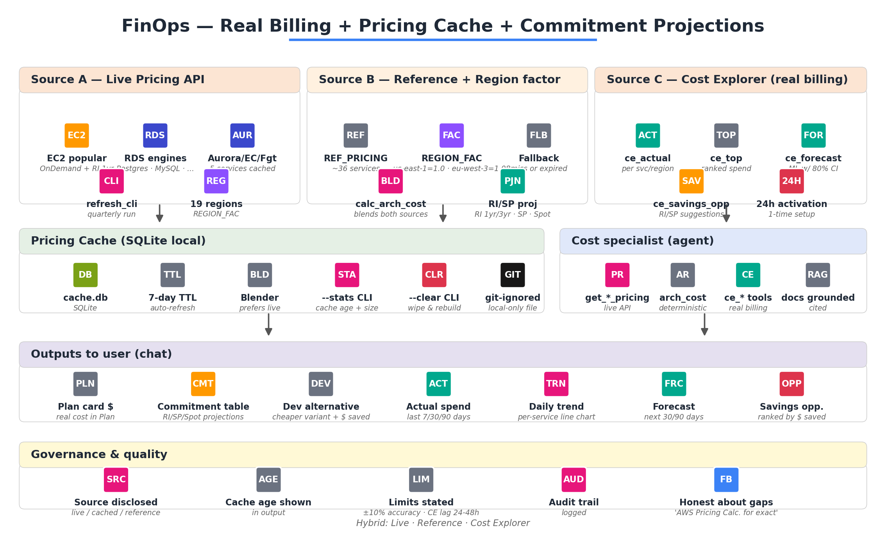

<div align="center">

# CloudAgent

**AI-powered desktop assistant for AWS operations.**
Conversational chat for inspection, provisioning, FinOps, and lifecycle management — grounded in official AWS documentation, with human-in-the-loop approval for every destructive action.

[]() []() []() []()

[Architecture](#architecture) · [Features](#features) · [Installation](#installation) · [Usage](#usage) · [Tool Catalog](#tool-catalog) · [Safety](#safety-model) · [Roadmap](#roadmap)

</div>

---

## Why CloudAgent?

AWS has 200+ services with thousands of configuration knobs. Engineers and FinOps practitioners juggle three competing needs every day:

1. **Speed** — operate on AWS without context-switching to docs or console
2. **Safety** — never destroy production resources by mistake
3. **Cost visibility** — know what things actually cost, not what AWS marketing says

CloudAgent collapses these into a conversational interface. You describe what you want; it grounds its response in official AWS documentation, computes real costs with the AWS Pricing API and Cost Explorer, asks for explicit human approval before mutating anything, and produces full AWS Well-Architected defaults on every new resource. Nothing is created or destroyed without you seeing the exact API call first.


---

## At a glance

| Capability | What it does |
|---|---|
| **Conversational AWS inspection** | "List my EC2 instances in eu-west-1", "DPU-hours consumed by Glue this month?" |
| **FinOps audit** | Real billing via Cost Explorer, ranked savings opportunities, forecasts |
| **Plan-first provisioning** | "Create a DynamoDB table" → Plan card with cost + defaults + CFN → Confirm → Approve → Execute |
| **Tiered lifecycle management** | T1 reversible · T2 safe waste · T3 destructive — approval required for each tier |
| **Architecture Advisor** | Greenfield design pipeline with 14 normalized criteria → docs-grounded design → IaC |
| **AWS certifications quiz** | 9 cert paths, exam-grade questions grounded in official AWS documentation |
| **Multi-LLM provider** | OpenAI GPT-4o or Anthropic Claude (configurable per request) |
| **Region-aware** | Region inference per thread; explicit region override anytime |

---

## Architecture

### High-level



Four-layer system:

1. **Desktop client** — Electron + React with Chat, Learn (advisor + quiz), Audit, and Manifest views
2. **API layer** — FastAPI with Server-Sent Events for token streaming + approval card events
3. **Agent core** — LangGraph multi-agent supervisor with documentation-first routing
4. **AWS layer** — boto3 for resource APIs, AWS Pricing API for live rates, Cost Explorer for real billing

### Multi-agent graph

The graph dispatches every user request through a documentation researcher first, then routes to one of 6 specialists based on intent + domain. Destructive operations pause at an `interrupt_before` checkpoint and emit an approval card to the UI.



Specialists:
- **Infrastructure** — EC2, VPC, ALB, lifecycle, all provisioning + delete tools
- **Security** — IAM, KMS, WAF, Secrets Manager, encryption audit
- **Cost & Pricing** — Pricing API, Cost Explorer, RI/SP projections
- **Data & Analytics** — Glue, Athena, Redshift, DynamoDB, Kinesis, MSK
- **DevOps** — CloudWatch, CloudFormation, Logs, alarms
- **Generalist** — cross-cutting questions

### Provisioning pipeline (creation_intent detected)

When a user asks to create a resource, the supervisor is bypassed and a deterministic 3-step ReAct pipeline runs:



1. **Reasoning** — LLM emits structured JSON (schema, access patterns, traffic, components) — hidden from user
2. **Pricing** — deterministic `calculate_architecture_cost` tool computes real $ — no LLM hallucination
3. **Plan card** — LLM composes user-facing Plan with reasoning + cost embedded as context

This guarantees every cost number in a Plan comes from code, not from the LLM.

### Cleanup workflow (cleanup_intent detected)

For bulk cleanup requests, the agent runs a 3-tier risk workflow:



- **Tier 1 reversible** — `rds_stop_instance`, `glue_disable_trigger`, `cloudwatch_disable_alarm`
- **Tier 2 low-risk waste** — `ec2_release_address`, `ec2_delete_volume`, `ec2_delete_snapshot`
- **Tier 3 destructive** — `ec2_terminate_instance`, `rds_delete_instance`, `cloudformation_delete_stack`

Each action requires explicit approval. Tier 3 actions trigger an extra warning before the approval card.

### Architecture Advisor (Learn page)

A separate pipeline for greenfield design questions, with 4 phases:



### Certifications quiz system



9 AWS certifications supported: CLF-C02, SAA-C03, DVA-C02, SOA-C02, SAP-C02, DOP-C02, SCS-C02, MLS-C01, DBS-C01. Every question is grounded in AWS documentation with adaptive difficulty + spaced repetition.

### FinOps subsystem



Three sources blended:
- **Live AWS Pricing API** — 5 services cached with both On-Demand and 1-year No-Upfront RI rates
- **Reference pricing** — 36 services hardcoded with `REGION_FACTORS` for 19 AWS commercial regions
- **Cost Explorer** — actual UnblendedCost (RI/SP discounts already applied) for real billing

---

## Features

### Documentation-first answers

Every chat response cites official AWS documentation retrieved live by the `docs_researcher` node before routing. If documentation can't be retrieved for a topic, the agent says so rather than hallucinating.

### Plan-first provisioning

When you ask to create a resource, the agent produces a **Provisioning Plan card** with:

- Concrete parameter table (chosen values + alternatives + per-component cost)
- "Production-grade defaults applied" list — AWS Well-Architected defaults baked in automatically:
  - Encryption at rest (KMS-managed or AWS-managed keys)
  - Multi-AZ where applicable
  - Flow Logs / access logs enabled
  - CloudWatch alarms with sensible thresholds
  - Backup retention (35 days default for RDS, 7 for Aurora)
  - Tags: `Environment`, `Project`, `Owner`, `CostCenter`, `CreatedBy=cloud-agent`
- **Real cost estimate** computed deterministically (no LLM hallucination)
- **Commitment savings table** — Reserved Instances 1yr/3yr, Savings Plans Compute/EC2, Spot
- **Dev/staging cheaper alternative** with explicit $ savings
- For CloudFormation paths: full YAML embedded in the Plan, deployable as-is

Nothing is created until you reply `confirm` (or click the Confirm button).

### Tiered lifecycle management

54 lifecycle tools organized by risk tier, with safety defaults that preserve data unless explicitly overridden:

- `dynamodb_delete_table` defaults to `backup_first=True`
- `rds_delete_instance` defaults to `skip_final_snapshot=False`
- `ec2_delete_volume` refuses if volume is in-use
- `s3_delete_bucket` refuses if bucket is non-empty unless `force_empty=True`
- `cloudformation_delete_stack` warns about cascade deletion
- `kms_schedule_key_deletion` uses a 30-day pending window (cancellable)
- `secretsmanager_delete_secret` uses a 30-day recovery window (restorable)

### Real billing via Cost Explorer

| Tool | Returns |
|---|---|
| `ce_actual_costs` | Actual UnblendedCost (RI/SP already applied) by service/region/instance-type |
| `ce_top_spenders` | Ranked top N services by spend |
| `ce_cost_forecast` | ML-based forecast for next N days with 80% confidence interval |
| `ce_savings_opportunities` | Per-service RI/SP savings projections with $ amounts |

### Transparency through SSE events

The streaming protocol surfaces every agent step to the UI:

- `agent_start` — node begins (shown as pipeline header in chat)
- `tool_start` / `tool_end` — tool invocations and their JSON results
- `status` — transient status during long operations
- `approval_required` — emitted when graph pauses at `interrupt_before` — renders the approval card with the pending tool call args
- `error` — surfaces errors with full stack trace, expandable in the UI

No infinite loading spinners — every state transition is visible.

### Region inference

The agent extracts AWS regions from natural language ("in eu-west-1", "for us-east-2") and persists the choice as `last_region` in the thread state. Subsequent turns inherit the region without you repeating it.

---

## Installation

### Prerequisites

- **Python 3.11+** (Conda recommended)
- **Node.js 18+** for the Electron frontend
- **AWS credentials** with appropriate IAM permissions (see [IAM policy](#iam-permissions))
- **OpenAI API key** OR **Anthropic API key** (configurable)
- **Cost Explorer** must be activated in your AWS account (one-time setup)

### Backend setup

```bash
git clone https://github.com/JEMALIACHRAF/cloud-agent-v2.git
cd cloud-agent-v2/backend

# Create environment
conda create -n ca-env python=3.11 -y
conda activate ca-env

# Install dependencies
pip install -r requirements.txt

# Configure
cp .env.example .env
# Edit .env with your AWS + OpenAI/Anthropic keys

# Run
uvicorn main:app --host 127.0.0.1 --port 8000
```

### Frontend setup

```bash
cd cloud-agent-v2/electron
npm install
npm run dev
```

The Electron window opens automatically once the backend is listening on port 8000.

### Pricing cache warmup (recommended)

```bash
cd backend
python scripts/refresh_pricing.py --service all --region eu-west-1
```

3-4 minutes, caches ~80 SKUs (EC2, RDS, Aurora, ElastiCache, Fargate) with both on-demand and 1-year Reserved Instance rates.

---

## Configuration

### Environment variables (`backend/.env`)

```bash
# AWS credentials
AWS_ACCESS_KEY_ID=AKIA...
AWS_SECRET_ACCESS_KEY=...
AWS_DEFAULT_REGION=eu-west-1

# LLM providers (at least one required)
OPENAI_API_KEY=sk-...
ANTHROPIC_API_KEY=sk-ant-...

# Optional
DEFAULT_MODEL=gpt-4o-mini       # or claude-sonnet-4
LOG_LEVEL=INFO
PRICING_CACHE_DB=./pricing_cache.db
```

### IAM permissions

Minimum read-only policy for chat queries:

```json
{
  "Version": "2012-10-17",
  "Statement": [
    {
      "Effect": "Allow",
      "Action": [
        "ec2:Describe*", "rds:Describe*", "s3:List*", "s3:Get*",
        "lambda:List*", "lambda:Get*", "glue:Get*",
        "dynamodb:List*", "dynamodb:Describe*",
        "cloudwatch:Describe*", "cloudwatch:Get*", "cloudwatch:List*",
        "logs:Describe*", "iam:List*", "iam:Get*",
        "ce:GetCostAndUsage", "ce:GetCostForecast",
        "pricing:GetProducts",
        "cloudformation:Describe*", "cloudformation:List*"
      ],
      "Resource": "*"
    }
  ]
}
```

For provisioning and lifecycle, additional `Create*`, `Delete*`, `Modify*` permissions are required for the specific services. **Recommended approach**: separate IAM user scoped by tag (`CreatedBy=cloud-agent`).

### Cost Explorer activation

Cost Explorer must be activated per account before its APIs return data:

1. AWS Console → Billing → Cost Explorer → **Launch Cost Explorer**
2. Wait 24 hours for data to populate
3. Verify with: `curl http://127.0.0.1:8000/health/cost-explorer`

---

## Usage

### Read-only inspection

```
"List my EC2 instances in eu-west-1"
"Show me my Glue jobs and their last run times"
"How many DPU-hours did my Glue jobs consume this month?"
"What's my AWS spend in the last 30 days, top 5 services?"
"Forecast next month's bill"
```

### Cost & FinOps

```
"What savings opportunities do I have in eu-west-1?"
"Daily cost trend for AWS Glue over the last 90 days"
"Audit FinOps de mes ressources eu-west-1"     ← triggers deep audit
"Deep FinOps audit on eu-west-1, include idle NAT and RDS"
```

### Provisioning (with approval gates)

```
"Create a DynamoDB table for user sessions"
"Build me a VPC with 2 public and 2 private subnets across 2 AZs"
"Provision an RDS Postgres in eu-west-3 for staging"
"Deploy a Lambda function with VPC access in eu-west-1"
```

Agent responds with a Plan card. Reply `confirm` to proceed → approval card → click Approve.

### Lifecycle / cleanup

```
"Stop all my running EC2 instances in eu-west-1 one by one"
"Disable my Glue triggers for datasets I don't use anymore"
"Delete the DynamoDB table UserSessions in eu-west-1"
"Delete the CloudFormation stack iot-pipeline-old"
"Release my unattached Elastic IPs"
"Schedule deletion of KMS key alias/legacy-app with 7-day window"
```

Each action triggers an approval card with the exact tool call args.

### Architecture advisor (Learn tab)

The Learn tab has a dedicated multi-step Architecture Advisor pipeline for greenfield design questions. Provide structured input (use case, constraints, workload, compliance, expertise level) and receive a comprehensive design with cost + IaC + AWS docs citations.

---

## Tool catalog

**125+ tools** organized by specialist domain. A subset:

### Infrastructure (read + lifecycle + provisioning)

| Category | Tools |
|---|---|
| **Inventory** | `ec2_list_instances`, `rds_list_instances`, `dynamodb_list_tables`, `lambda_list_functions`, `s3_list_buckets` |
| **FinOps quick wins** | `ec2_list_volumes`, `ec2_list_addresses`, `ec2_list_snapshots`, `cleanup_recommendations`, `cleanup_recommendations_deep` |
| **Creation (Plan workflow)** | `ec2_launch_instance`, `s3_create_secure_bucket`, `rds_create_instance`, `aurora_create_cluster`, `dynamodb_create_table`, `sqs_create_queue`, `sns_create_topic`, `route53_create_hosted_zone`, `elasticache_create_redis`, `kms_create_key`, `secretsmanager_create_secret`, `cognito_create_user_pool`, `aws_deploy_cloudformation` |
| **Tier 1 lifecycle** | `ec2_stop_instance`, `rds_stop_instance`, `glue_disable_trigger`, `cloudwatch_disable_alarm` |
| **Tier 2 lifecycle** | `ec2_release_address`, `ec2_delete_volume`, `ec2_delete_snapshot`, `rds_delete_db_snapshot`, `elasticache_delete_snapshot`, `dynamodb_delete_backup`, `backup_delete_recovery_point` |
| **Tier 3 lifecycle** | `ec2_terminate_instance`, `rds_delete_instance`, `lambda_delete_function`, `cloudformation_delete_stack`, `dynamodb_delete_table`, `s3_delete_bucket`, `iam_delete_user`, `cognito_delete_user_pool`, `kms_schedule_key_deletion`, `secretsmanager_delete_secret` |
| **Network lifecycle** | `ec2_delete_security_group`, `ec2_delete_nat_gateway`, `ec2_delete_internet_gateway`, `ec2_delete_subnet`, `ec2_delete_vpc`, `route53_delete_hosted_zone` |
| **Container** | `eks_delete_cluster`, `eks_delete_nodegroup`, `ecs_delete_cluster`, `ecs_delete_service`, `autoscaling_delete_group` |

### Cost & Pricing

| Tool | Purpose |
|---|---|
| `get_ec2_pricing`, `get_rds_pricing` | Live AWS Pricing API |
| `calculate_architecture_cost` | Multi-service cost with region factor + RI/SP projections |
| `ce_actual_costs` | Actual UnblendedCost from Cost Explorer |
| `ce_top_spenders` | Ranked top services by spend |
| `ce_cost_forecast` | ML forecast next N days with 80% CI |
| `ce_savings_opportunities` | RI/SP savings projections per service |

### Data & Analytics

| Tool | Purpose |
|---|---|
| `glue_list_databases`, `glue_list_jobs`, `glue_list_crawlers`, `glue_list_triggers` | Glue inventory |
| `glue_total_dpu_usage`, `glue_get_job_runs` | DPU consumption + cost analysis |
| `glue_inspect_job_pipeline` | Trace job → script → S3 inputs/outputs → firing triggers |
| `athena_list_workgroups`, `athena_delete_workgroup` | Athena management |
| `dynamodb_describe_table`, `dynamodb_list_backups` | DynamoDB introspection |
| `redshift_delete_cluster`, `redshift_delete_snapshot` | Redshift lifecycle |
| `kinesis_delete_stream`, `firehose_delete_delivery_stream`, `msk_delete_cluster` | Streaming lifecycle |
| `opensearch_delete_domain` | Search service lifecycle |

### Security

| Tool | Purpose |
|---|---|
| `iam_list_users`, `iam_list_roles`, `iam_list_access_keys` | IAM inventory |
| `iam_get_account_summary` | Account security posture |
| `ec2_list_security_groups`, `s3_get_bucket_policy` | Network + storage policy audit |
| `kms_list_keys`, `secretsmanager_list_secrets` | Crypto + secrets inventory |

### DevOps

| Tool | Purpose |
|---|---|
| `cloudformation_describe_stack`, `cloudformation_list_stack_resources` | Stack introspection |
| `cloudwatch_list_alarms`, `cloudwatch_get_metric` | Monitoring |
| `logs_describe_groups`, `logs_get_events` | Log analysis |
| `stepfunctions_delete_state_machine`, `events_delete_rule` | Orchestration cleanup |
| `apigateway_delete_rest_api`, `cloudfront_delete_distribution` | API/CDN cleanup |
| `sagemaker_delete_endpoint`, `efs_delete_file_system` | Misc service cleanup |

---

## Safety model

CloudAgent is opinionated about safety. Five non-negotiable principles:

1. **Read-only by default.** Every mutating tool is in the `DESTRUCTIVE_TOOLS` set and triggers a LangGraph `interrupt_before` pause. The graph cannot execute past this checkpoint without explicit user resume.

2. **Plan-first provisioning.** No resource is ever created without an explicit Plan card displayed first. The Plan includes cost, defaults applied, and (for CFN) the full template — visible *before* any AWS API call.

3. **Per-action approval for cleanup.** The cleanup workflow processes one action at a time. Mass-execution without user input is architecturally impossible — each tool call is its own interrupt.

4. **Production-grade defaults baked in.** AWS Well-Architected defaults (encryption, Multi-AZ, backups, alarms, tags) are applied automatically unless explicitly overridden.

5. **Data preservation by default.** Safety-default flags on every deletion tool:
   - `rds_delete_instance` takes final snapshot unless `skip_final_snapshot=True`
   - `dynamodb_delete_table` creates backup unless `backup_first=False`
   - `ec2_delete_volume` refuses if volume is in-use
   - `cloudformation_delete_stack` warns about cascade
   - `kms_schedule_key_deletion` uses 30-day pending window
   - `secretsmanager_delete_secret` uses 30-day recovery window

### What CloudAgent will NOT do

- Modify AWS resources without an approval card
- Run destructive operations in bulk without per-action consent
- Suggest hardcoded credentials in templates (uses Secrets Manager refs)
- Delete resources you didn't acknowledge by name
- Disable Cost Explorer or observability features without explicit request

---

## Development

### Project structure

```
cloud-agent-v2/
├── backend/                          Python FastAPI + LangGraph
│   ├── main.py                       FastAPI entry
│   ├── core/
│   │   ├── agent.py                  LangGraph multi-agent definition (1,600+ lines)
│   │   ├── session.py                AWS credential management
│   │   ├── docs_search.py            AWS docs retrieval
│   │   ├── console_urls.py           AWS console URL builder
│   │   └── audit.py                  Operation audit logging
│   ├── routers/
│   │   ├── agent.py                  Chat SSE streaming endpoint
│   │   ├── learn.py                  Architecture advisor pipeline
│   │   ├── certifications.py         Quiz generation
│   │   └── audit.py                  Compliance + FinOps reports
│   ├── tools/aws/                    100+ AWS tools by service
│   │   ├── ec2.py, rds.py, s3.py, lambda_.py
│   │   ├── glue_extended.py          Crawlers, triggers, DPU, pipeline tracer
│   │   ├── pricing.py                Reference pricing + commitment projections
│   │   ├── pricing_cache.py          SQLite cache (7-day TTL)
│   │   ├── cost_explorer.py          Cost Explorer API
│   │   ├── lifecycle.py              54 stop/delete tools
│   │   └── provisioning.py           16 creation tools + CFN
│   └── scripts/
│       └── refresh_pricing.py        CLI for warming pricing cache
├── electron/                         Frontend
│   ├── main.js                       Electron main process
│   └── renderer/
│       ├── components/
│       │   ├── ChatView.jsx          Chat + approval cards
│       │   ├── LearnView.jsx         Architecture advisor
│       │   ├── AuditView.jsx         FinOps + security findings
│       │   └── RichMessage.jsx       Section-aware message rendering
│       └── hooks/
│           └── useAgent.js           SSE event handler
└── docs/
    └── diagrams/                     7 architecture diagrams (PNG)
```

### Adding a new tool

1. Create the function in `backend/tools/aws/<your_module>.py`:

```python
from langchain_core.tools import tool

@tool
async def my_new_tool(param: str, region: str = "us-east-1") -> dict:
    """One-line description (becomes the LLM's tool description).
    Explain inputs, outputs, side effects."""
    return {"success": True, "data": ...}
```

2. Register in `backend/core/agent.py`:
   - Import: `from tools.aws.<module> import my_new_tool`
   - Add to the relevant specialist tool list (`INFRA_TOOLS`, `COST_TOOLS`, etc.)
   - **If destructive**: add the tool name string to `DESTRUCTIVE_TOOLS` set

3. Restart `uvicorn`. The tool is now available to the LLM.

### Running tests

```bash
cd backend
pytest tests/ -v
```

### Pricing cache management

```bash
python scripts/refresh_pricing.py --service all --region eu-west-3
python scripts/refresh_pricing.py --service ec2          # specific service
python scripts/refresh_pricing.py --stats                # cache size + sources
python scripts/refresh_pricing.py --clear                # wipe & rebuild
```

---

## Operations

### Audit trail

Every mutating tool execution is logged via `core/audit.py` to SQLite (`backend/audit.db`):

```bash
sqlite3 backend/audit.db "SELECT tool_name, args, success, ts FROM tool_calls ORDER BY ts DESC LIMIT 20"
```

### Logs

Backend logs to stdout. Key markers:
- `[docs_researcher]` — intent detection (creation, confirmation, cleanup, deletion)
- `[provisioning_*]` — ReAct pipeline steps
- `[supervisor]` — routing decisions

---

## Troubleshooting

| Symptom | Cause | Fix |
|---|---|---|
| "State check failed: name '_build_approval_event' is not defined" | Pre-v22 install | Upgrade — helpers must be defined at module level before `stream_agent` |
| Chat shows infinite loading after Confirm | Pre-v19 — graph pauses but no event emitted | Upgrade to v19+ for interrupt detection |
| Cost Explorer returns error | Not activated in AWS account | AWS Console → Billing → Cost Explorer → Launch. Wait 24h. |
| Pricing API returns 403 | Missing `pricing:GetProducts` permission | Add to IAM policy. Note: Pricing API only responds in `us-east-1`, `eu-central-1`, `ap-south-1` |
| Agent answers in wrong region | No region inferred from thread | Mention region explicitly in first message ("in eu-west-1") |
| Approval card never appears | Wrong supervisor routing | Check that intent matches the regex; check `DESTRUCTIVE_TOOLS` membership |
| LLM rate limits | OpenAI tier-1 (30k TPM) | Switch to `gpt-4o-mini` or upgrade tier |

---

## Roadmap

- [ ] EKS pod-level introspection
- [ ] Multi-account support via AssumeRole
- [ ] Slack/Teams integration for approval workflows
- [ ] OpenTelemetry tracing for tool execution
- [ ] Backup/Restore operations as chained workflows
- [ ] CloudWatch dashboard generation from natural language
- [ ] Terraform state diff via `terraform-cdk` adapter
- [ ] Auto-remediation suggestions for Security Hub findings

---

## Honest limits

CloudAgent is a **decision support tool**, not a billing system or AWS Console replacement.

- Cost estimates from `calculate_architecture_cost` are hardcoded reference pricing × region factor, accurate to ±10%. For exact prediction use the [AWS Pricing Calculator](https://calculator.aws).
- Reserved Instances / Savings Plans projections use empirical discount percentages (17–60%), not your account's actual eligibility offers.
- Cost Explorer data has 24–48 hour lag.
- LLM tool selection may occasionally produce incorrect calls; the approval interrupt is your safety net.
- "Next Steps" suggestions in chat responses are generated by the LLM and should be cross-checked.

---

## License

MIT License. See [LICENSE](LICENSE) for details.

---

## Acknowledgments

- **AWS Documentation** — every chat response is grounded in official AWS docs
- **LangGraph** by LangChain — multi-agent orchestration with interrupts
- **AWS Pricing API** — live pricing data for 5 services
- **AWS Cost Explorer API** — real billing integration
- **Capgemini SogetiLabs** — apprenticeship context that informed production-grade patterns

---

<div align="center">

**Built by [Achraf Jemali](https://github.com/JEMALIACHRAF)** · Data & AI Consultant · Paris/Île-de-France

[Report a bug](https://github.com/JEMALIACHRAF/cloud-agent-v2/issues) · [Request a feature](https://github.com/JEMALIACHRAF/cloud-agent-v2/issues) · [Discussions](https://github.com/JEMALIACHRAF/cloud-agent-v2/discussions)

</div>
